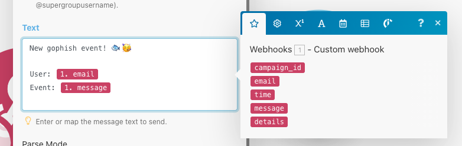

# Gophish Telegram Bot

## 1. Create a Telegram Bot

Visit https://telegram.me/botfather

To create a new Telegram bot, send command `/newbot`.
Give the Telegram bot a friendly name.

Copy the access code, we'll need that later.

### 1.1 New Telegram Channel
Next, let's setup a [channel](https://telegram.org/tour/channels) for the bot to send messages to. Create a new channel and add yourself and anyone else you want to it:

Also, add the bot you created as an administrator:

## 2. Setup up Integromat

Visit https://www.integromat.com/ and create a new account

Select 'Create a new Scenario':

Search for 'Webhook' and select the 'Webooks' option on the left, andd then in the same search box 'telegram' and select the Telegram option and finaly click Continue:

In the scenario, click on the Webhook, and then choose 'Custom Webhook'. Click 'Add' to create a new webhook, giving it a suitable name:

Copy the address to the clipboard for the next step.

## 3. Add Webhook to Gophish

Login to your gophish account, and choose Webhooks from the side menu. Add a new Webhook and paste the Integromat endpoint from the previous step:

Now all gophish events will be sent to Integromat.

## 4. Set up Telegram on Integromat

Head back to the Integromat Scenario from step 2. Click the Telegram icon at the bottom and select the 'Send a Message' option:

Click on the Telegram bobble to set it up. First, let's connect the bot. Select Add from the Connection field at the top, give it a name, and paste the token from the bot we created in Step 1:

There are a few ways to figure out the Chat ID. The easiest way seems to be to sign in to https://web.telegram.org, click on your channel, and note the ID in the URL bar. e.g:

The channel ID is the portion after the *c* and before the underscore. You'll also need to prepend `-100`. So, for example, if in the URL you have:

https://web.telegram.org/#/im?p=c12346789_5544332211

Then the the channel ID that you need to paste into Integromat would be `-100123456789`

Next up we need to process the webhook message and choose what to ask the bot to send to the channel. It's a good idea here to create a campaign and maybe submit some data etc, firing the webhook, and then Integromat will show you fields received from the webhook message. You can then click and choose which ones you want to add. For example:

That should be it! Just turn the scenario on, and your bot should send any webhook messages to the Telegram channel!